# STM32-Hotspot/STM32WB-BLE-PER-Testbench MCU Firmware Package, based on STM32CubeWB Release v1.13.1

## Example

This Hotspot FW package includes:
* Application example under "Projects\P-NUCLEO-WB55.Nucleo\Applications\BLE" called BLE_PER_Testbench.     
   * This example aims to demonstrates how to enable BLE Direct Test Mode (DTM) in the STM32WB from a firmware user application using HCI testing commands directly to perform a Packet Errror Rate (PER) measurement without the need of an external software tool like STM32CubeMonitor-RF or physical cable connections to the DUT.  
   * The Transmitter (packet generator) is set up to transmit test packets (i.e. PRBS9) continuously. 
   * The Receiver DUT is set up to calculate PER on an interval expected to have received a set number of packets. We can predetermine that it takes 938 ms for the packet generator (Tx) to transmit 1500 packets of 37bytes, PRBS9, in 1M PHY, therefore, this time can then be applied on the receiver as a receive window and read the number of packets actually received, then compare it against the expected number of packets (1500) for this time window and calculate the PER from that.  The receiver will also measure and report the RSSI level for that time window. 
   * Two NUCLEO-WB55RG boards can be used for the Transmitter and Receiver, however, the firmware can be tailored to run on any other platform based on STM32WB. the firmware .hex image file is provided in this package. 
   * A custom Android Smartphone app called "ST PER Testbench" is used to configure the radio mode and corresponding test parameters for the Transmitter and Reciver devices, respectively. 
   * The PER and RSSI measurement results can be viewed from a PC's serial terminal connected to the NUCLEO-WB55RG/DTM Rx device or from the "ST PER Testbench" Android Smartphone since the DTM-Rx device also advertises its results for 1s after every Rx window. 
   * Development tools, toolchains/compilers: IAR EWARM V9.20.x, STM32CubeIDE v1.8.0
   * Supported Devices and hardware boards: NUCLEO-WB55RG
   * Known limitations: None

## Hardware Needed

  * Two NUCLEO-WB55RG
    * [NUCLEO-WB55RG](https://www.st.com/en/evaluation-tools/nucleo-wb55rg.html)
	
  * Android Smartphone with Bluetooth LE 4.2 support
  
## Software Needed

  * Prebuilt firmware image, BLE_PER_Testbench.hex, provided under "STM32WB-BLE-PER-Testbench\Projects\P-NUCLEO-WB55.Nucleo\Applications\BLE\BLE_PER_Testbench\Binaries"
	
  * Android Smartphone app provided under "STM32WB-BLE-PER-Testbench\Utilities\Android_Software"

## User's Guide
* Install the .apk app on an Android Smarphone 
* Install the .hex firmware on both NUCLEO-WB55RG boards 
* Run the firmware on two NUCLEO-WB55RG boards
* Connect a serial terminal (Tera Term) to the boards. (This step is optional, but used here for demonstrations purposes) 

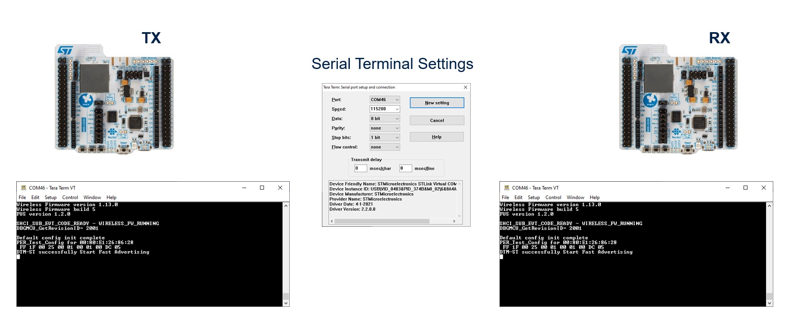

* Launch BLE PER Testbench app. You should see two devices appear in scan window named DTM-ST. This is the name device name when they have not been configured. 
* Use the RSSI indicator to identify the board that you want to configure as the Transmitter. Placing the phone in close proximity to the WB device will cause the RSSI for the respective device to go high. 
* Once identified, you can tap the “CONNECT”

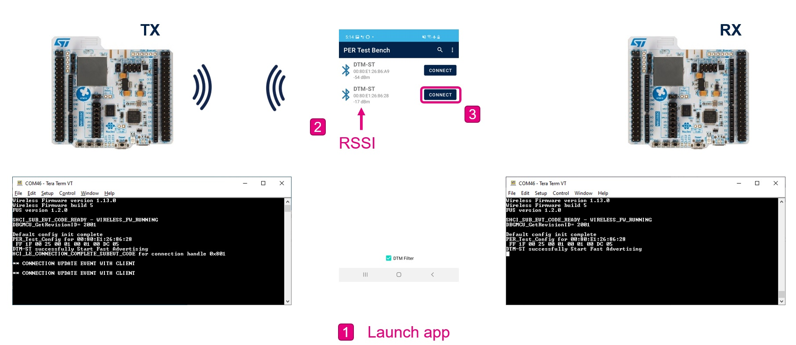

* Configure the Transmitter using the parameters provided
* Tap “CONFIGURE”
* Tap the back arrow button to return to the scan window

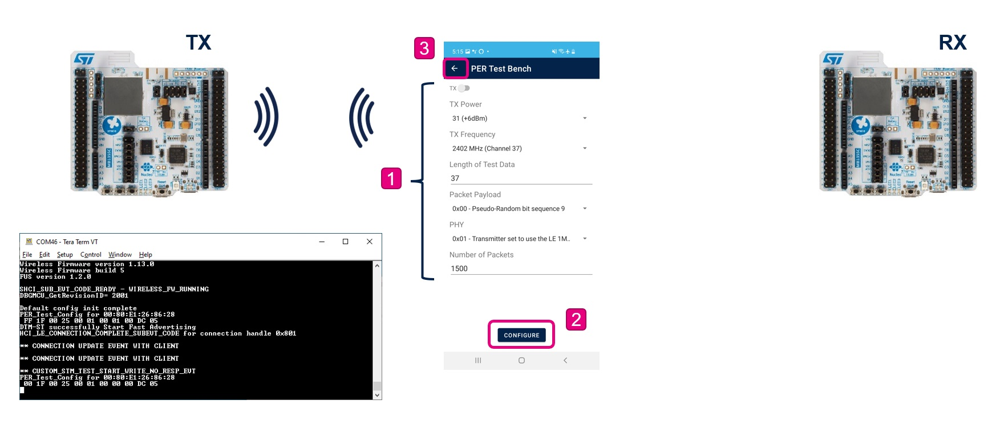

* Notice that the device just configured is now named “DTM-TX”. 
* Configure the other device (DTM-ST) as the Receiver by tapping “CONNECT”

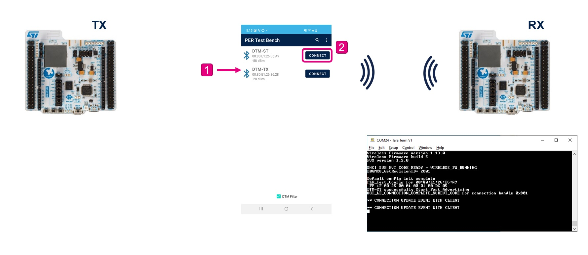

* Configure the device as a Receiver by moving the switch to RX. 
* Configure the Receiver using the parameters provided 
* Tap “CONFIGURE”
* Tap the back arrow button to return to the scan window

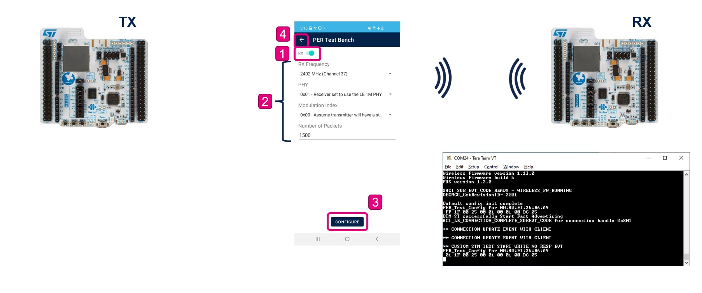

* Now, user should see two devices named DTM-TX and DTM-RX

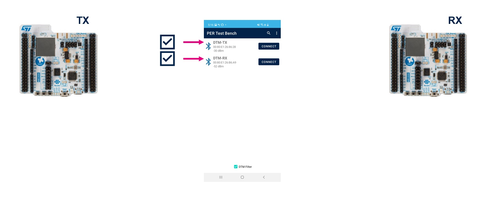

* Start the Transmitter by pressing the SW1 button. 
* The Blue LED1 will turn on solid
* The Green LED2 will blink; turning on when device radio is actively transmitting and turn off when it is not transmitting. 
* There’s also a trace on the serial terminal to indicate the start of the DTM Tx mode

Note: In the firmware, PB0 was configured in AF6 mode (EXT_PA_TX) to control CTX pin for Ext PA applications. Note that this configuration has no radio effect when running on the NUCLEO-WB55RG platform since there is no Ext PA in place, but since PB0 is used to drive the green LED2 on this board, the LED2 will blink according to the radio Tx/Rx state;  hi for radio transmit and low for receive. However, the firmware setup is added here for flexiblity in case this firmware is ran on a platform that does have an Ext PA in place, such as the MB1586A reference board which includes the SKY66118-11 PA from Skyworks Solutions (max output power = +20 dBm)

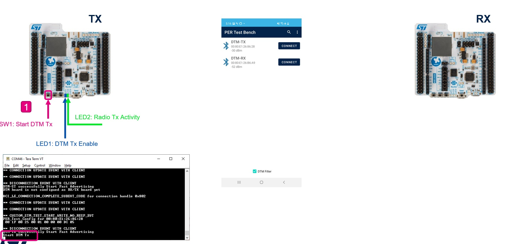

* Start the DTM Receiver by pressing the SW1 button.
* The Blue LED1 will turn on solid 
* The Green LED2 will blink; turning on when device radio is actively transmitting and turn off when it is receiving. 

* On the smartphone app’s scan window, a GRAPH button will appear in the place of the CONNECT button, this is because when the device is operating in DTM Receive mode, it is no longer connectable. Tap the GRAPH button. 

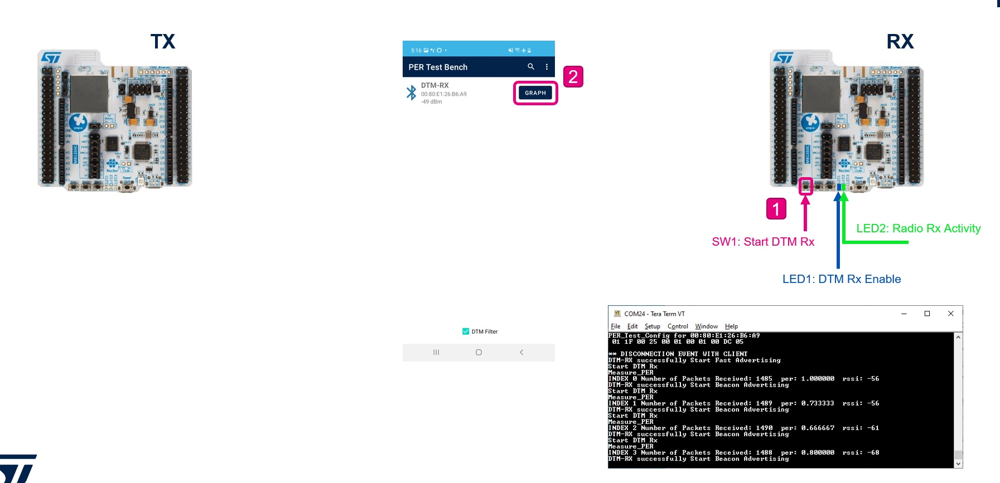

* The GRAPH window is where the user can see the PER measurement results coming from the Receiver device. There’s an RSSI and a PER graph along with a results table displaying the current result values.   

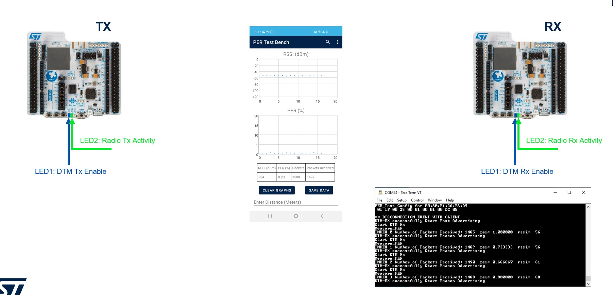

* The app also includes a data entry feature that the user can use to log the distance between the Transmitter and the Receiver. This is useful if the user is using this for radio range measurements. 
	* There’s a field to enter distance in meters and a SAVE DATA button to save the entered distance value in a .csv file on the phone’s filesystem.  This .csv file can be found under the smartphones file system

* User can stop the DTM Transmitter and/or Receiver at any time by pressing SW2 

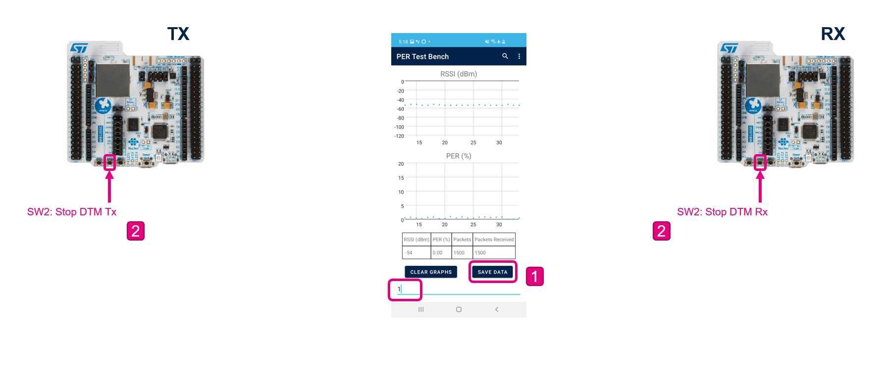

* User can perform range performance measurement by setting up a Transmitter device in a field and walk away with the receiver DUT and view the PER results from their smartphone. 

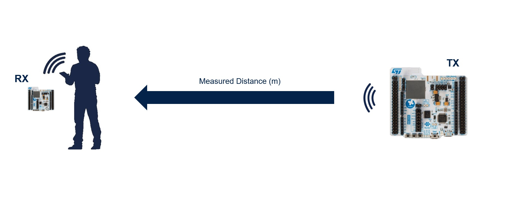  

## Troubleshooting

**Caution** : Issues and the pull-requests are **not supported** to submit problems or suggestions related to the software delivered in this repository. The BLE_Basic_DataThroughput_Server example is being delivered as-is, and not necessarily supported by ST.

**For any other question** related to the product, the hardware performance or characteristics, the tools, the environment, you can submit it to the **ST Community** on the STM32 MCUs related [page](https://community.st.com/s/topic/0TO0X000000BSqSWAW/stm32-mcus).
